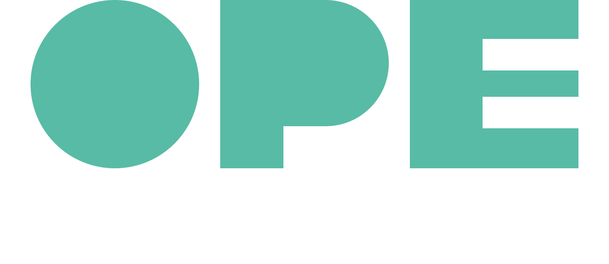

# OPE

## One Page for Equity

This projects aims to create a dashboard with variety of gender based information and visualisation.

According to law french companies now are required to measure and publish information on following aspects"
 - pay comparison for men, women and non-binary people based on their age and job position
 - gap in the rate of individual salary increases between women and men
 - comparison in promotions between women and men and representation of different genders in management
 - effect of parenthood and maternity leave on salaries
 - representation of genders in companies top 10 highest-paid employees

## How to use OPE

Upload your `.csv` file et voila!
